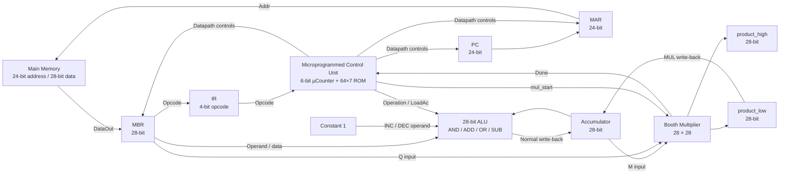
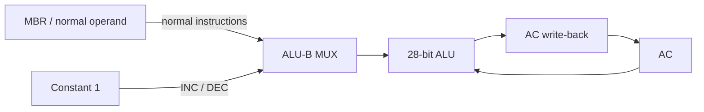
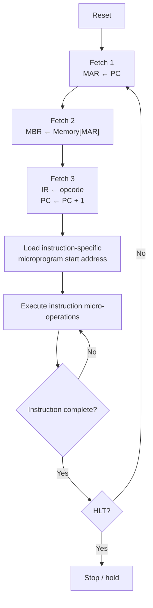
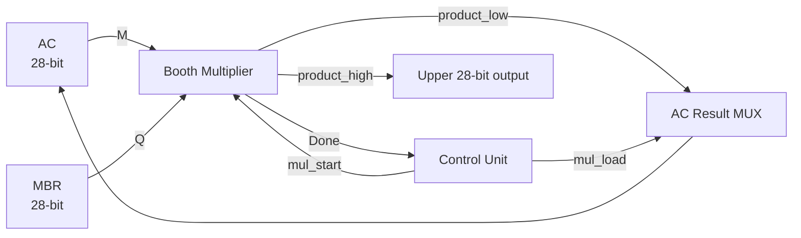
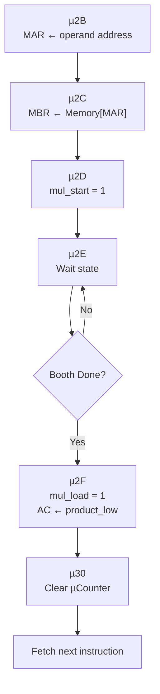
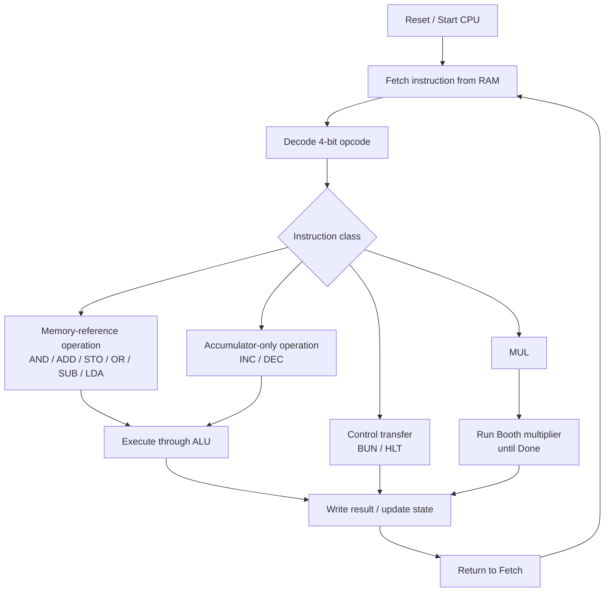

<div align="center">

# 28-Bit Microprogrammed CPU in Logisim

### Final fixed revision — a modular 28-bit processor with microprogrammed control, reusable ALU hardware, INC/DEC support, and an integrated Booth multiplier


A computer-architecture project focused on **datapath design, microprogrammed control, instruction execution, ALU reuse, and iterative signed multiplication**.

</div>

---

## Overview

This repository contains the **final fixed three-circuit baseline** of a custom **28-bit CPU implemented in Logisim**. The processor uses an accumulator-oriented datapath, a **64 × 7 control ROM**, a **6-bit micro-sequence counter**, and reusable external circuit libraries for the ALU and Booth multiplier.

The design supports **11 machine instructions** covering arithmetic, logic, memory transfer, unconditional branching, accumulator increment/decrement, halt, and multi-cycle Booth multiplication. The documentation below is aligned with the committed `.circ` implementation rather than a generic CPU model.

### Key specifications

| Feature | Implementation |
|---|---|
| Data word | **28 bits** |
| Instruction size | **28 bits / 7 hex digits** |
| Opcode | **4 bits** |
| Address / operand field | **24 bits** |
| Main memory | **24-bit address, 28-bit data** |
| Program Counter | **24-bit counter** |
| MAR | **24 bits** |
| MBR | **28 bits** |
| IR | **4 bits** |
| Accumulator | **28 bits** |
| ALU operation select | **2 bits** |
| Micro-sequence counter | **6 bits** |
| Control ROM | **64 addresses × 7-bit control word** |
| Multiplier | **28 × 28 Booth multiplier** |
| Full multiplication result | **56 bits = product_high : product_low** |

---

## Repository Structure

```text
28-BIT-CPU/
├── 28bit_cpu.circ
├── 28bit_alu.circ
├── Booths_multiplication28bit.circ
└── README.md
```

| File | Responsibility |
|---|---|
| `28bit_cpu.circ` | Main CPU, registers, datapath, RAM interface, Control Unit, and Booth integration |
| `28bit_alu.circ` | 28-bit arithmetic/logic unit and supporting ALU subcircuits |
| `Booths_multiplication28bit.circ` | Iterative 28-bit Booth multiplier with start/done handshake and 56-bit result |
| `README.md` | Architecture, ISA, execution flow, and usage documentation |

### Verified circuit hierarchy

| File | Implemented circuits / subcircuits |
|---|---|
| `28bit_cpu.circ` | `main`, `CPU`, `ControlUnit` |
| `28bit_alu.circ` | `main`, `Input_way`, `ANDCIRC`, `ORCIRC`, `FULL_adder`, `big_full_adder`, `x_or`, `add_sub`, `get_the_msb`, `ALU_broad`, `seventeen_bit_reduced_or` |
| `Booths_multiplication28bit.circ` | `Booth's multiplier`, `Controller` |

> Keep the three `.circ` files in the **same directory**. The committed CPU file uses repository-portable relative library references to `28bit_alu.circ` and `Booths_multiplication28bit.circ`.

---

## High-Level Architecture



The CPU follows a **control-path / datapath separation**: the ROM-based Control Unit decides *what should happen*, while the registers, multiplexers, ALU, RAM interface, and Booth unit perform the actual data movement and computation.

---

## Instruction Format

Every machine instruction is one 28-bit word:

```text
 27                    24 23                                0
+------------------------+-----------------------------------+
|      OPCODE (4)        |       ADDRESS / OPERAND (24)      |
+------------------------+-----------------------------------+
```

Because 28 bits correspond to **7 hexadecimal digits**, instructions are easy to load manually into RAM.

Example:

```text
A000005
│└────── 24-bit address = 0x000005
└─────── opcode A = MUL
```

---

## Instruction Set Architecture

| Opcode | Mnemonic | Operation |
|---:|---|---|
| `0x0` | **AND** | `AC ← AC AND M[address]` |
| `0x1` | **ADD** | `AC ← AC + M[address]` |
| `0x2` | **STO** | `M[address] ← AC` |
| `0x3` | **OR** | `AC ← AC OR M[address]` |
| `0x4` | **SUB** | `AC ← AC - M[address]` |
| `0x5` | **BUN** | `PC ← address` |
| `0x6` | **LDA** | `AC ← M[address]` |
| `0x7` | **HLT** | Halt processor execution |
| `0x8` | **INC** | `AC ← AC + 1` |
| `0x9` | **DEC** | `AC ← AC - 1` |
| `0xA` | **MUL** | `AC × M[address]`; lower 28 result bits are written back to AC |

For instructions that do not use an address field, the lower 24 bits can remain zero:

```text
INC = 8000000
DEC = 9000000
HLT = 7000000
```

---

## ALU Design

The reusable 28-bit ALU uses a 2-bit operation code:

| Operation | ALU function |
|---|---|
| `00` | AND |
| `01` | ADD |
| `10` | OR |
| `11` | SUB |

### Hardware reuse for INC and DEC

INC and DEC do **not** require separate arithmetic units. A 28-bit constant `1` is selected as the second ALU operand:

```text
INC: AC + 1  → reuse ADD
DEC: AC - 1  → reuse SUB
```



This keeps the datapath compact and demonstrates **functional-unit reuse** rather than duplicating arithmetic hardware.

### ALU status outputs

The `ALU_broad` circuit also exposes the following status outputs:

| Output | Meaning |
|---|---|
| `carry` | Carry / borrow-related arithmetic status |
| `overflow` | Signed arithmetic overflow indication |
| `negative` | Sign-state indication from the result |
| `zero` | Indicates a zero ALU result |

These outputs exist in the ALU implementation, but the current CPU does **not** store them in a dedicated architectural flag/status register and does not currently provide conditional-branch instructions based on them.

---

## Microprogrammed Control Unit

The control path is based on:

- a **6-bit micro-sequence counter**
- a **64 × 7 ROM**
- a **4-to-16 decoder**
- operation-encoding logic
- combined datapath control signals
- dedicated MUL handshake logic

The ROM output is a 7-bit control word. The upper portion selects a decoder action while the lower bits manage micro-sequencer behavior such as count, clear, or loading the next instruction-specific microaddress.

For multiplication, the Control Unit additionally exposes `mul_start` and `MUL load`, receives `booth done`, and combines the normal ROM count path with the Booth-completion advance path so the micro-sequence counter can remain at the wait state until the multiplier finishes.

### Instruction execution flow



---

## Booth Multiplication Integration

Multiplication is implemented as a dedicated **28 × 28 iterative Booth multiplier**.

### Verified multiplier structure

| Element | Implementation |
|---|---|
| Multiplicand register | `M`, 28-bit shift register |
| Partial accumulator | `A`, 28-bit shift register |
| Multiplier register | `Q`, 28-bit shift register |
| Previous multiplier bit | `Q-1`, 1 bit |
| Iteration counter | 5-bit counter, initialized with `0x1C` = 28 |
| Internal controller | 3-bit `CAR` with an 8 × 12 control ROM |
| Completion output | `Done` |
| Product outputs | `product_high[27:0]`, `product_low[27:0]` |

The Booth datapath reuses the project ALU library for arithmetic during the add/subtract phases and performs the required shift-and-count sequence under the multiplier's own controller.

### CPU ↔ Multiplier interface



The complete product is:

```text
┌─────────────────────────────── 56-bit product ───────────────────────────────┐
│                  product_high                 │          product_low          │
│                     28 bits                   │             28 bits           │
└───────────────────────────────────────────────────────────────────────────────┘
```

The current CPU stores:

```text
AC ← product_low
```

The upper half remains available at `product_high`. It is **not currently stored in a dedicated CPU HI register**.

---

## MUL Control Flow

Opcode `0xA` starts at microaddress `0x2B`.



| µAddress | Control action | Architectural effect |
|---|---|---|
| `2B` | Load operand address | `MAR ← MBR[23:0]` |
| `2C` | Memory read | `MBR ← M[MAR]` |
| `2D` | Assert `mul_start` | Initialize/start Booth multiplication |
| `2E` | Wait | Hold micro-sequencer until `Done = 1` |
| `2F` | Assert `mul_load` | `AC ← product_low` |
| `30` | Clear micro-sequence counter | Return to common fetch |

This handshake allows the CPU to wait for a multi-cycle arithmetic unit **without advancing the instruction sequence prematurely**.

---

## End-to-End CPU Flow



---

## Example Program — 3 × 4

The following RAM contents demonstrate LDA, MUL, STO, and HLT:

| Address | Machine word | Meaning |
|---:|---:|---|
| `0x000000` | `6000004` | `LDA 0x000004` |
| `0x000001` | `A000005` | `MUL 0x000005` |
| `0x000002` | `2000006` | `STO 0x000006` |
| `0x000003` | `7000000` | `HLT` |
| `0x000004` | `0000003` | Data = 3 |
| `0x000005` | `0000004` | Data = 4 |
| `0x000006` | `0000000` | Result location |

Expected lower-word result:

```text
3 × 4 = 12 decimal = 0x000000C

AC     = 000000C
M[006] = 000000C
```

---

## How to Run

### Requirements

- **Logisim 2.7.1** or a compatible Logisim implementation
- All three committed `.circ` files kept together in the same directory

### Procedure

1. Clone or download the repository.
2. Confirm these files are in the same directory:
   - `28bit_cpu.circ`
   - `28bit_alu.circ`
   - `Booths_multiplication28bit.circ`
3. Open `28bit_cpu.circ`.
4. Open the main circuit.
5. Load a machine-code program into RAM using **Edit Contents**.
6. Assert/reset the CPU.
7. Return Reset low.
8. Advance the clock manually or enable simulation ticks.
9. Observe the datapath and control signals.

### Recommended signals to watch

```text
PC
MAR
MBR
IR
AC
µCounter
ROM output
Operation
LoadAc
mul_start
booth_done
mul_load
product_low
product_high
RAM DataOut
```

For MUL, the expected sequence is:

```text
2D → 2E → 2E → ... → 2E → 2F → 30 → 00
     waiting for Booth Done ↑
```

---

## Datapath Summary

```text
                         ┌───────────────────────┐
                         │   Control Unit        │
                         │  µCounter + ROM       │
                         └──────────┬────────────┘
                                    │ control
                                    ▼
PC ──► MAR ──► RAM ──► MBR ──► ALU ──► AC
                      │        ▲        │
                      │        │        │
                      │    Constant 1   │
                      │                 │
                      └──► Booth ◄──────┘
                           │      ▲
                    product_low  mul_start
                           │
                           └────────────► AC
```

---

## Design Principles

The project intentionally emphasizes several computer-architecture concepts:

- **Microprogrammed control** instead of implementing every instruction with a separate hardwired state machine
- **Hardware reuse** for INC/DEC by reusing ADD/SUB
- **Modular circuit libraries** for CPU, ALU, and multiplication
- **Explicit register-transfer behavior** through MAR, MBR, AC, IR, and PC
- **Multi-cycle functional-unit handshaking** for Booth multiplication
- **Separation of control path and datapath**
- **Manual machine-code visibility**, useful for demonstrations and architecture labs

---

## Current Scope

This README documents the **final fixed CPU / ALU / Booth baseline currently committed to `main`**.

Implemented:

- ✅ 28-bit CPU datapath
- ✅ 24-bit memory addressing
- ✅ ROM-based microprogrammed Control Unit
- ✅ AND / ADD / STO / OR / SUB / BUN / LDA / HLT
- ✅ INC / DEC
- ✅ Integrated Booth multiplication
- ✅ Start/Done multiplier handshake
- ✅ 56-bit Booth result exposure
- ✅ Lower 28-bit multiplication write-back to AC

Current architectural limitations:

- `product_high` is exposed by the Booth multiplier but is not stored in a dedicated architectural register.
- ALU status outputs are available inside the ALU library, but the CPU currently has no dedicated architectural flag register.
- The baseline memory interface remains a 24-bit-address / 28-bit-data main-memory interface; cache integration can be developed as a separate memory-hierarchy extension.

---

## Final Implementation Verification

The committed circuit baseline was reviewed against the actual Logisim source structure. Key verified implementation points are:

- CPU data/instruction word: **28 bits**
- Machine instruction format: **4-bit opcode + 24-bit address/operand**
- PC and MAR: **24 bits**
- MBR and AC: **28 bits**
- IR: **4 bits**
- Main RAM interface: **24-bit address / 28-bit data**
- ALU selector: **2 bits** for AND, ADD, OR, SUB
- Micro-sequence counter: **6 bits**
- Control ROM: **64 × 7**
- MUL wait/handshake signals: **`mul_start` → `booth done` → `MUL load`**
- Booth product: **56 bits**, exposed as `product_high : product_low`
- CPU MUL write-back: **`AC ← product_low`**

The Mermaid diagrams in this README describe the committed datapath and control flow at an architectural level; the `.circ` files remain the source of truth for gate-level wiring.

---

## Possible Extensions

- Add a dedicated **HI register** for `product_high`
- Add conditional branch instructions
- Add architectural status/flag register usage
- Add stack and subroutine instructions
- Add interrupts
- Add I/O instructions and peripherals
- Add cache / memory hierarchy experiments
- Add an assembler for the 28-bit instruction format
- Add automated regression programs for each opcode

---

## Educational Value

This project demonstrates how a CPU is built from fundamental components rather than treated as a black box. It connects:

**instruction encoding → fetch/decode → microcode → control signals → datapath movement → ALU execution → memory access → multi-cycle multiplication → write-back**

That makes the repository useful for studying **Computer Architecture, Digital Logic Design, microprogrammed control, datapath construction, and Booth multiplication**.

---

<div align="center">

### Built as a hands-on 28-bit CPU architecture project in Logisim

**Main circuit:** `28bit_cpu.circ`

</div>